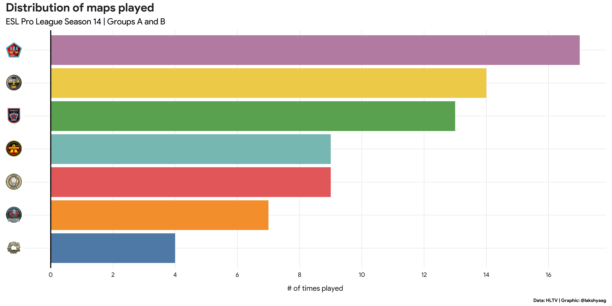
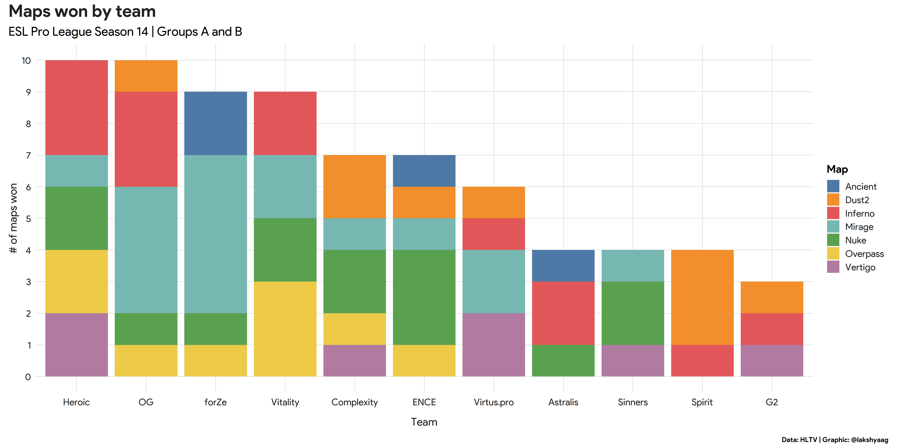
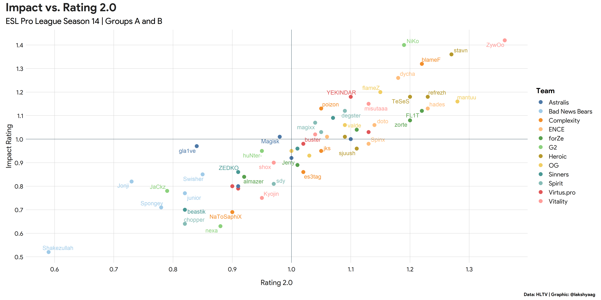
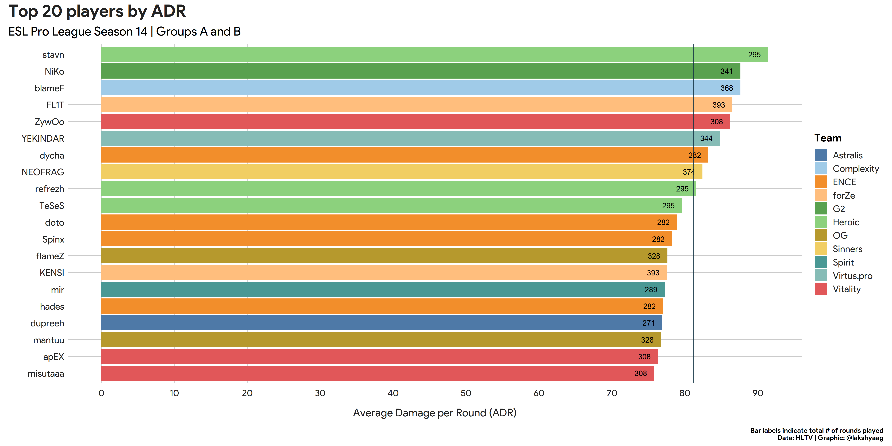
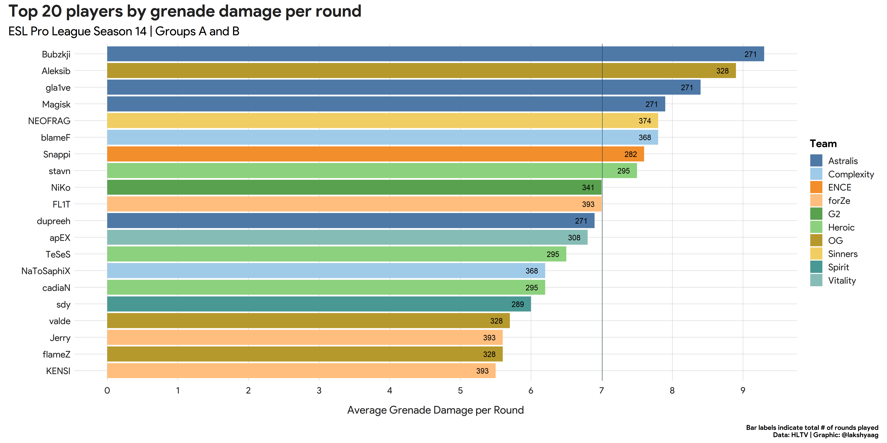
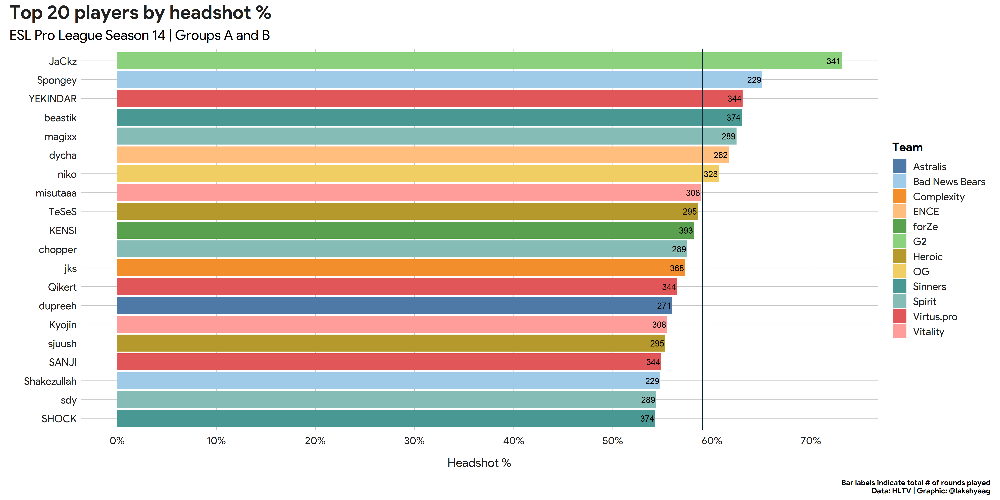
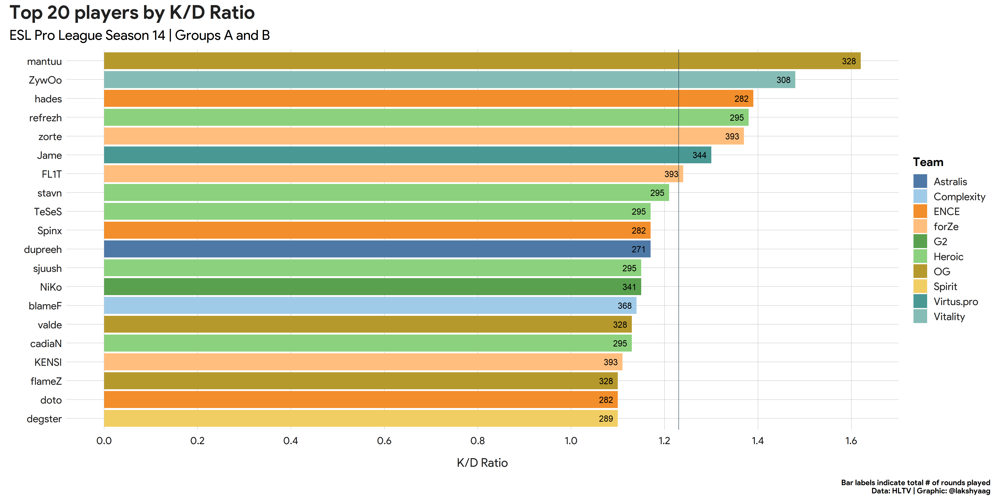
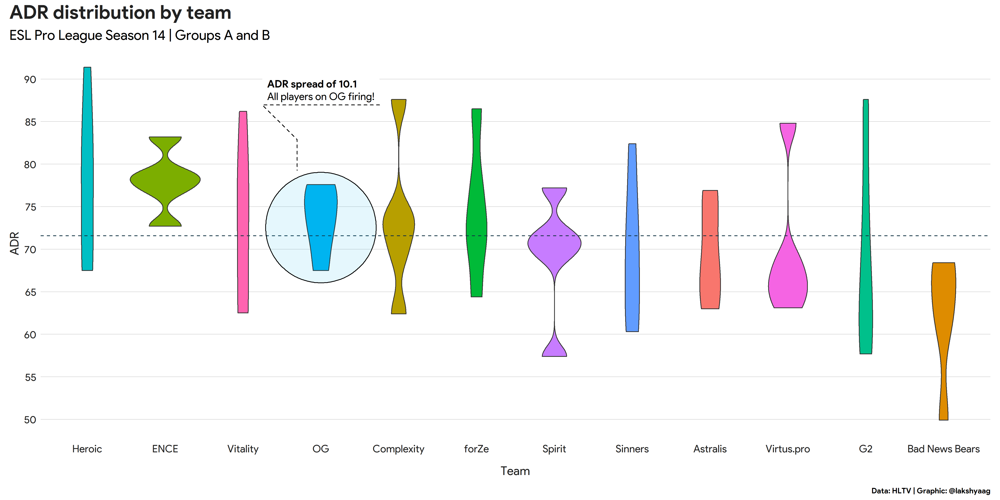
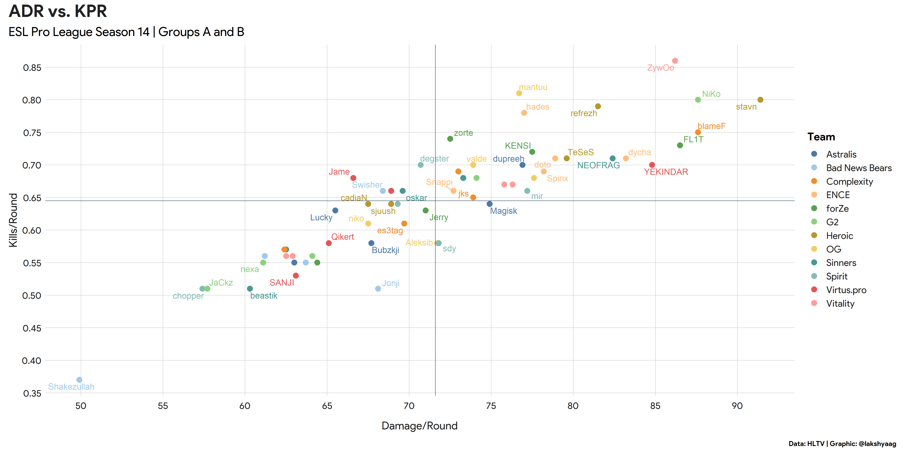

# ESL Pro League Season 14 - Groups A and B

The round-robin group stage for 10 teams in the [ESL Pro League Season 14](https://www.hltv.org/events/5554/esl-pro-league-season-14) concluded recently. Here, I take a look at how the **players** performed over the past 2 weeks across 30 matches.

## Maps played and team performance

Before diving into the players' performance, let's quickly take a look at the map distribution currently.

No surprises there, **Mirage** (dust3?) clearly the go-to map. Surprised to see Ancient being picked just 4 times out of a potential 45 _(BO3 x 15 matches)_

**OG** and **forZe** seem to have figured out Mirage nicely, while **Heroic** relied more on other maps.

---

## Player performance

### **Impact** vs **Rating 2.0**

Some **key takeaways** from this graphic:

* *ZywOo* with another amazing performance, boasting an Impact Rating of 1.4 and a Rating 2.0 of 1.36
* *NiKo* clearly let down by his teammates this time around (**G2** went 0-5 in groups)
* 3 out of 5 players for both **Heroic** and **OG** appear in the top-right quadrant, indicating ___high impact___ as well as ___high rating___

### Top players by **ADR**

*stavn* leading the group with an ADR of 91 across 295 rounds, followed by *NiKo* and *blameF* with an ADR of 88.

### Top players by **grenade damage per round**

**THREE** **Astralis** players (*Bubzjki*, *gla1ve* and *Magisk*) feature in the top 5 players dealing the most grenade damage per round, while *dupreeh* does appear in the top 20. Not at all surprised to see *Aleksib* at #2.

### Top players by **headshot %**

Although *JaCkz* had a relatively poor performance (0.79 rating), it did not stop him for tapping away at enemy heads, leading to a staggering **HS% of 73%.**

### Top players by **K/D Ratio**

*mantuu* miles ahead of the competition here with a K/D ratio of **1.62**, followed by *ZywOo* at **1.48**.

Kind of expected this since both these players are AWPers and have to save more often than their teammates.

### Team ADR

> This last graphic is probably my favorite.

It shows the **spread of ADR** of each player in every team. To be sure, a *longer violin* indicates a *larger ADR spread* in a team, i.e., ***a greater difference between the player with the highest ADR and that with the lowest ADR, indicative of under-performance.***

Some **key takeways** from this graphic:

* Although both **Heroic** and **OG** topped their respective groups, it is clear that **OG** played more *as a team*, while **Heroic** had some players perform exceptionally well (*stavn* with an ADR of 91 from earlier)
* Among the other teams, **Astralis** has the lowest spread, while **G2** has the highest (*NiKo* the only player from **G2** to feature in Top 20)
* **Spirit** and **Virtus.Pro** have a lot of work to do

---

## Summary

It was a great two weeks for CSGO, especially after a month-long player break.

**Heroic** and **OG** have had an amazing performance so far in their respective groups, with **Vitality** and **forZe** coming in as close contenders. **G2**'s performance came out as quite an upset, with them not taking a single match.

*ZywOo*, *mantuu* and *stavn* will be the key players to watch from this group, but I'm more excited to see how the teams and players in Group C and D pan out, before making any predictions for the playoffs.

---

That's it for now! Hope this analysis was a little insightful.

I would love to hear feedback and comments on how I can improve, so please feel free to contact me on **[Twitter](https://twitter.com/lakshyaag)** or shoot me an **[e-mail](mailto:lakshyagrwal12@gmail.com)**.

The graphs were create in R using [`{ggplot2}`](https://ggplot2.tidyverse.org/) and some custom theming.

I have a couple more graphics that I created but couldn't incorporate them above, so I'll post them after this.

